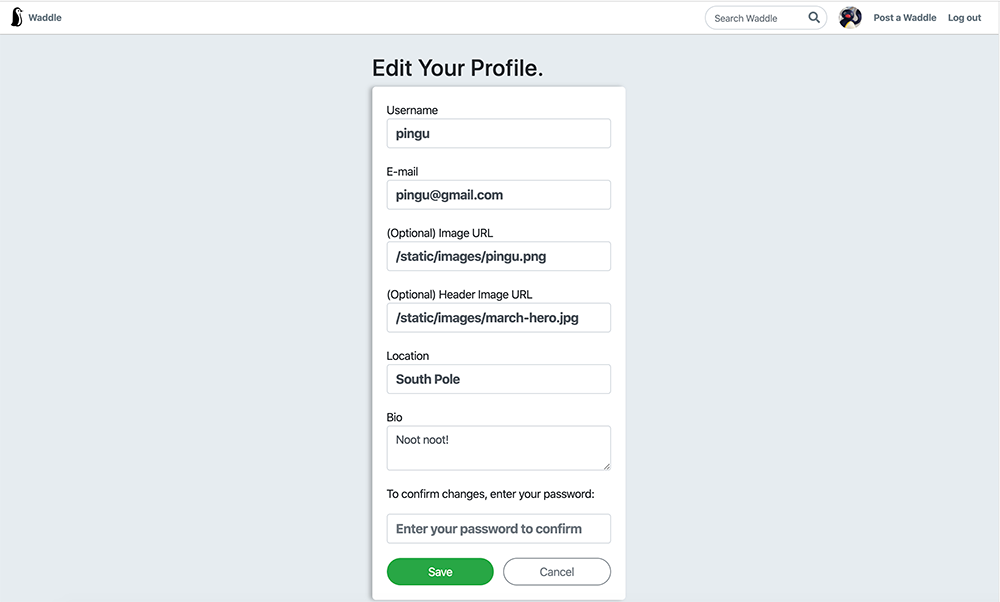
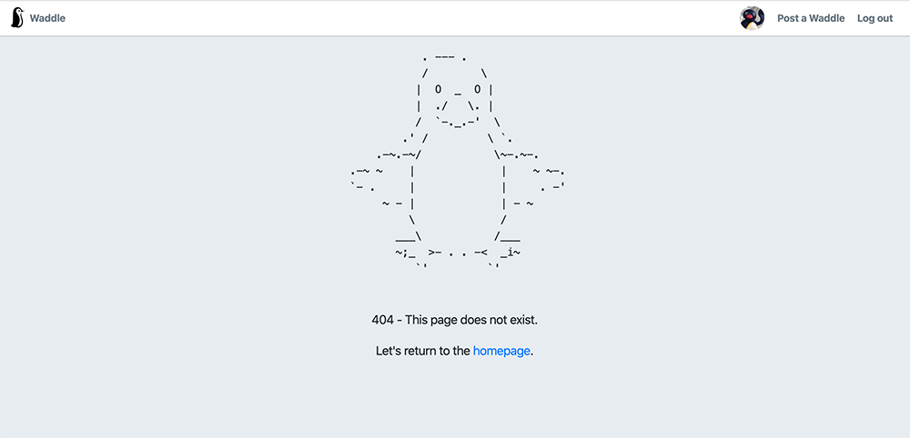

# Waddle

Waddle is a Twitter clone built with Flask, server-side rendering, and Jinja templates. This app allows users to sign up with a password protected account, edit their profile, write posts, like posts, and follow users. 

Unit and integration tests are written with the Python standard library unittest module. Passwords are encrypted and stored in the database.  

Waddle is [live on Render](https://waddle.onrender.com/).

Test username: `testuser`  
Test password: `testuser`





## Table Of Contents
- [Installation](https://github.com/kathyn138/Waddle#installation)
- [Testing](https://github.com/kathyn138/Waddle#testing)
- [Technologies](https://github.com/kathyn138/Waddle#technologies)
- [Future Implementations](https://github.com/kathyn138/Waddle#future-implementations)

## Installation 

These steps should be done sequentially. 

Setting up the Python virtual environment

```
python3 -m venv venv
source venv/bin/activate
pip install -r requirements.txt
```

Setting up the production and test database

```
createdb waddle
python seed.py
createdb waddle-test
```

Starting the server from within the virtual environment: 

```flask run```

## Testing
The following commands should be run within the virtual environment.

Testing the user model: 

```
python -m unittest test_user_model.py
```

Testing user views: 
```
python -m unittest test_user_views.py
```

Testing the message model: 
```
python -m unittest test_message_model.py
```

Testing message views: 
```
python -m unittest test_message_views.py
```

## Technologies

- Flask
- HTML/CSS
- Jinja
- jQuery
- Python

## Future Implementations
- Add loading spinners